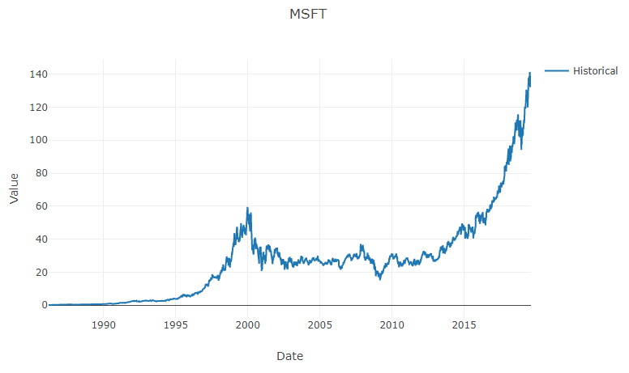

# Step 3: Display a Graph

We have stock market time-series data in memory now, but it'd be more useful if we could see it.

## Add a TimeSeriesAnalysis Class

Eventually, we're going to want to generate forecasts for our time series, so let's add a record to bundle the raw time-series data with the associated predictions.
Add a new **TimeSeriesAnalysis.cs** file with this class definition:

```csharp
record TimeSeriesAnalysis(TimeSeries TimeSeries);
```

## Add a ChartBuilder Class

We added the [Plotly.NET.CSharp](https://plotly.net) NuGet package back in [step 1](./Step1.md).
Let's put it to use now.
Add a new **ChartBuilder.cs** file with this class definition:

```csharp
using Microsoft.FSharp.Collections;
using Plotly.NET;
using Plotly.NET.LayoutObjects;

static class ChartBuilder
{
    public static GenericChart.GenericChart BuildChart(TimeSeriesAnalysis analysis)
    {
        IEnumerable<Trace> traces = BuildTraces(analysis);
        FSharpList<Trace> fSharpTraces = ListModule.OfSeq(traces);
        GenericChart.GenericChart chart = BuildPlotlyChart(analysis.TimeSeries.Name, fSharpTraces);
        return chart;
    }

    private static IEnumerable<Trace> BuildTraces(TimeSeriesAnalysis analysis)
    {
        yield return BuildTrace("Historical", analysis.TimeSeries.Observations);
    }

    private static Trace BuildTrace(string name, IEnumerable<Observation> observations)
    {
        DateTime[] dates = observations.Select(s => s.Date).ToArray();
        float[] values = observations.Select(s => s.Value).ToArray();

        var trace = new Trace("scatter");
        trace.SetValue("name", name);
        trace.SetValue("x", dates);
        trace.SetValue("y", values);

        return trace;
    }

    private static GenericChart.GenericChart BuildPlotlyChart(string chartTitle, FSharpList<Trace> traces)
    {
        LinearAxis xAxis = new LinearAxis();
        xAxis.SetValue("title", "Date");

        LinearAxis yAxis = new LinearAxis();
        yAxis.SetValue("title", "Value");

        Layout layout = new Layout();
        layout.SetValue("xaxis", xAxis);
        layout.SetValue("yaxis", yAxis);
        layout.SetValue("showlegend", true);
        layout.SetValue("width", 800);
        layout.SetValue("height", 500);

        return Plotly.NET.GenericChart
            .ofTraceObjects(true, traces)
            .WithLayout(layout)
            .WithTitle(chartTitle);
    }
}
```

## Generate Time-Series Analysis

Now we're ready to pull things together back in the main **Program.cs** file.
First, let's add an `Analyze` method to create a `TimeSeriesAnalysis` for each `TimeSeries`.

```csharp
static IEnumerable<TimeSeriesAnalysis> Analyze(IEnumerable<TimeSeries> timeSeriesList)
{
    foreach (TimeSeries timeSeries in timeSeriesList)
    {
        var analysis = new TimeSeriesAnalysis(timeSeries);
        yield return analysis;
    }
}
```

## Show Charts

Next, we need another method in the **Program.cs** file to build and display all our charts.

```csharp
static void ShowCharts(TimeSeriesAnalysis[] analysisResults)
{
    var charts = new List<GenericChart.GenericChart>();

    foreach (TimeSeriesAnalysis analysis in analysisResults)
    {
        GenericChart.GenericChart chart = ChartBuilder.BuildChart(analysis);
        charts.Add(chart);
    }

    charts.ForEach(chart => chart.Show());
}
```

This will require another new `using` statement at the top of the file.

```csharp
using Plotly.NET;
```

## Pull It All Together

It's the moment of truth.
Update the top-level statements to call our new helper methods.

```csharp
TimeSeries[] stockSeries = StockLoader.Load();
IEnumerable<TimeSeriesAnalysis> analysisResults = Analyze(stockSeries);
ShowCharts(analysisResults);
Console.WriteLine("Finished!");
```

## Test

Let's build and run to see if everything worked.
The call to `chart.Show()` should launch your default web browser to view an HTML file **Plotly.NET** wrote to a temp folder.



## Next

Go to [Step 4: Forecast With Linear Regression](./Step4.md).
