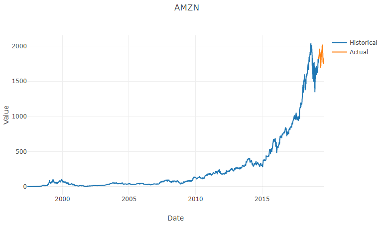
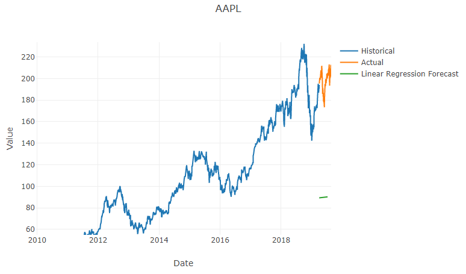

# Step 4: Forecast With Linear Regression

We can display a time series now, but we haven't done any prediction yet.
Let's add a forecast based on a very simple [linear regression](https://en.wikipedia.org/wiki/Linear_regression).

## Add a ForecastDetails Class

If we're going to forecast, we need a structure to store the predicted values.
We'll also add an algorithm name, since we want to add more options with ML.NET.

Add a new **ForecastDetails.cs** file with this class definition:

```csharp
using System.Collections.Generic;
using System.Linq;

namespace Anomalies
{
    internal class ForecastDetails
    {
        public string AlgorithmName { get; }
        public Observation[] Forecast { get; }

        public ForecastDetails(string algorithmName, IEnumerable<Observation> forecast)
        {
            AlgorithmName = algorithmName;
            Forecast = forecast.ToArray();
        }
    }
}
```

## Expand TimeSeriesAnalysis Structure

To evaluate our forecasting algorithm, we'll divide the observations in each time series.
We'll call the older observations "historical."
We'll call the 100 most recent observations "actual."
The algorithm will be given only the historical observations and asked to predict the next 100 values in the series.
We can compare the predicted values to the actual values to see how accurate the algorithm was.

Go back to the `TimeSeriesAnalysis` class we created earlier, and add some new properties:

```csharp
using System.Collections.Generic;
using System.Linq;

namespace Anomalies
{
    internal class TimeSeriesAnalysis
    {
        public TimeSeries TimeSeries { get; }
        public Observation[] Historical { get; }
        public Observation[] Actual { get; }
        public ForecastDetails[] Forecasts { get; }

        public TimeSeriesAnalysis(
            TimeSeries timeSeries,
            IEnumerable<Observation> historical,
            IEnumerable<Observation> actual,
            IEnumerable<ForecastDetails> forecasts)
        {
            TimeSeries = timeSeries;
            Historical = historical.ToArray();
            Actual = actual.ToArray();
            Forecasts = forecasts.ToArray();
        }
    }
}
```

We changed the constructor, so we'll need some changes before that will compile.

## Split Historical and Actual Data

Return to the `Program` class to fix the call to the `TimeSeriesAnalysis` constructor.
Update the `Analyze` method to split the time series observations into historical and actual data.
Create an empty list of `ForecastDetails` for now, since we don't yet have a forecasting algorithm.

```csharp
private static IEnumerable<TimeSeriesAnalysis> Analyze(IEnumerable<TimeSeries> timeSeriesList)
{
    const int horizon = 100;

    foreach (TimeSeries timeSeries in timeSeriesList)
    {
        Observation[] observations = timeSeries.Observations;
        Observation[] historical = observations.Take(observations.Length - horizon).ToArray();
        Observation[] actual = observations.Skip(observations.Length - horizon).ToArray();

        var forecasts = new List<ForecastDetails>();

        var analysis = new TimeSeriesAnalysis(timeSeries, historical, actual, forecasts);
        yield return analysis;
    }
}
```

Note the choice of 100 for the `horizon` is arbitrary.
You can adjust the value depending on how far into the future you want to predict.

A new `using` statement will be required at the top of the file.

```csharp
using System.Linq;
```

## Prepare Charts for Forecasting

Return to `ChartBuilder` and update the `BuildTraces` method as follows.
Each chart now divides the real time-series data into historical and actual data.
Once we've predicted values, those will also be displayed.

```csharp
private static IEnumerable<Graph.Trace> BuildTraces(TimeSeriesAnalysis analysis)
{
    yield return BuildTrace("Historical", analysis.Historical);
    yield return BuildTrace("Actual", analysis.Actual);

    foreach (ForecastDetails forecastDetails in analysis.Forecasts)
    {
        string name = $"{forecastDetails.AlgorithmName} Forecast";
        yield return BuildTrace(name, forecastDetails.Forecast);
    }
}
```

## Test Historical and Actual Data Division

Let's build and run to see what changed.
The chart should now show each time series divided into historical and actual data based on the selected horizon.
Click and drag on the chart to zoom in for a closer look.



## Specify Intervals

Before we can really do linear regression, we'll need to know the expected interval between observations in our time series.

Revisit the `TimeSeries` class to add an `Interval` property.

```csharp
public TimeSpan Interval { get; }
```

This requires a new `using` statement.

```csharp
using System;
```

Initialize that property from the constructor.

```csharp
public TimeSeries(
    string name,
    IEnumerable<Observation> observations,
    TimeSpan interval)
{
    Name = name;
    Observations = observations.ToArray();
    Interval = interval;
}
```

Before the project will build, we must update the `StockLoader` to specify an interval of one day when loading stock prices.

```csharp
// Group rows by stock name.  Create a TimeSeries for each group.
TimeSeries[] timeSeriesList = stocks
    .ToLookup(stock => stock.Name)
    .Select(group => new TimeSeries(
        name: group.Key,
        observations: group.Select(s => s.ToObservation()),
        interval: TimeSpan.FromDays(1)))
    .ToArray();
```

## Linear Regression Forecasting

We're finally ready to write our first forecasting algorithm.
Let's create a simple linear regression algorithm.
It finds a straight line that is a good fit for the data by minimizing a cost function.

Add a new **LinearRegressionForecaster.cs** file with this class definition:

```csharp
using System;
using System.Collections.Generic;
using System.Linq;

namespace Anomalies
{
    internal class LinearRegressionForecaster
    {
        public static Observation[] Forecast(Observation[] observations, int horizon, TimeSpan interval)
        {
            // Convert the observations into (x,y) points.
            float[] x = observations.Select(o => (float)o.Date.Ticks).ToArray();
            float[] y = observations.Select(o => o.Value).ToArray();

            // Use linear regression to fit a line to the points.
            (float intercept, float slope) = FitLine(x, y);

            // Use the slope/intercept definition of the line to predict future values.
            var predictions = new List<Observation>();
            DateTime currentTime = observations.Last().Date;

            for (int i = 0; i < horizon; i++)
            {
                currentTime = currentTime.Add(interval);
                float currentX = (float)currentTime.Ticks;
                float predictedValue = slope * currentX + intercept;
                var prediction = new Observation { Date = currentTime, Value = predictedValue };
                predictions.Add(prediction);
            }

            return predictions.ToArray();
        }

        private static (float intercept, float slope) FitLine(float[] x, float[] y)
        {
            float meanX = x.Sum() / x.Length;
            float meanY = y.Sum() / y.Length;

            float covariance = 0.0f;
            float variance = 0.0f;

            for (int i = 0; i < x.Length; i++)
            {
                float diff = x[i] - meanX;
                variance += diff * diff;
                covariance += diff * (y[i] - meanY);
            }

            float slope = covariance / variance;
            return (meanY - slope * meanX, slope);
        }
    }
}
```

## Use the Forecaster

Our `LinearRegressionForecaster` is ready to go.
Let's start using it in the `Analyze` method of our `Program` class.
Add a few new lines right after the declaration of the `forecasts` variable inside the `foreach` loop.

```csharp
Observation[] linearRegressionForecast = LinearRegressionForecaster
    .Forecast(historical, horizon, timeSeries.Interval);
forecasts.Add(new ForecastDetails("Linear Regression", linearRegressionForecast));
```

## Test Linear Regression

How well does it work?
Let's run it and see.
We have a new line for the linear regression.
It's tiny, and it's far below the actual data.
It also seems to be a little too short.
What's wrong?



## Next

Go to [Step 5: Wrangle Data](./Step5.md).
