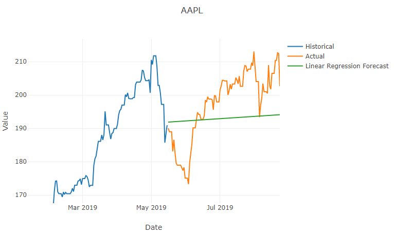

# Step 5: Wrangle Data

As we observed at the end of [step 4](./Step4.md), a linear regression doesn't work very well when you're working with multiple years of stock market data.
The stock market in general [follows an exponential growth curve](https://www.quora.com/Does-the-stock-market-have-an-exponential-upward-trend-or-just-a-general-upward-trend).
If you plot it on a logarithmic scale, it'll be nearly linear.
But all is not lost; let's use only the most recent data to perform our linear regression.

## Update Linear Regression to Limit Data Used

Return to the `LinearRegressionForecaster` class and add the following code at the very start of the `Forecast` method.

```csharp
// Use only the most recent observations.
int recentLimit = 5 * horizon;
if (observations.Length > recentLimit)
{
    observations = observations.Skip(observations.Length - recentLimit).ToArray();
}
```

## Test Most Recent Data Limit

Run the program again, zoom in, and you'll see a much closer fit.


That's good, but the data points in the forecast still stop before the end of the actual data.
Why?

## Understanding Our Data

Let's open **big_five_stocks.csv** again to look at our data.
Note there are gaps in the dates for weekends and holidays.
We have an unevenly spaced time series, but our linear regression algorithm assumes even spacing between samples.

```csv
,name,open,close,high,low,volume
1971-02-05,^IXIC,100.0,100.0,100.0,100.0,0.0
1971-02-08,^IXIC,100.84,100.84,100.84,100.84,0.0
1971-02-09,^IXIC,100.76,100.76,100.76,100.76,0.0
1971-02-10,^IXIC,100.69,100.69,100.69,100.69,0.0
1971-02-11,^IXIC,101.45,101.45,101.45,101.45,0.0
1971-02-12,^IXIC,102.05,102.05,102.05,102.05,0.0
1971-02-16,^IXIC,102.19,102.19,102.19,102.19,0.0
1971-02-17,^IXIC,101.74,101.74,101.74,101.74,0.0
1971-02-18,^IXIC,101.42,101.42,101.42,101.42,0.0
...
```

We could adapt our algorithm to handle irregular data, but some forecasting algorithms expect equal intervals between observations.
Let's try some data wrangling (or data munging) instead.

## Fill the Gaps

Since this is stock market data, it's reasonable to fill in the missing days with the most recent closing price from a day when the market was open.
Let's add a utility to fill those gaps.

Add a new **GapFiller.cs** file with this class definition:

```csharp
using System;
using System.Collections.Generic;
using System.Linq;

namespace Anomalies
{
    internal class GapFiller
    {
        public static IEnumerable<Observation> FillGaps(ICollection<Observation> observations, TimeSpan interval)
        {
            TimeSpan tolerance = interval / 2;
            DateTime expectedDate = observations.First().Date;
            float lastValue = observations.First().Value;

            foreach (Observation observation in observations)
            {
                while (expectedDate + tolerance < observation.Date)
                {
                    yield return new Observation(expectedDate, lastValue);

                    expectedDate = expectedDate.Add(interval);
                }

                yield return observation;

                expectedDate = observation.Date.Add(interval);
                lastValue = observation.Value;
            }
        }
    }
}
```

To put this to use, return to the `Analyze` method in the **Program.cs** file.
Locate the first line inside the `foreach` loop.
Currently, it reads as follows:

```csharp
Observation[] observations = timeSeries.Observations.ToArray();
```

Replace that line with:

```csharp
var observations = GapFiller.FillGaps(timeSeries.Observations.ToArray(), timeSeries.Interval).ToArray();
```

## Test Filling the Gaps

Let's see if our forecast looks better now.
Run the program and zoom in on the forecasts.
The forecast now spans the same number of days as the actual data.



We're done with our first kind of forecasting.

## Next

Go to [Step 6: Evaluation](./Step6.md).
